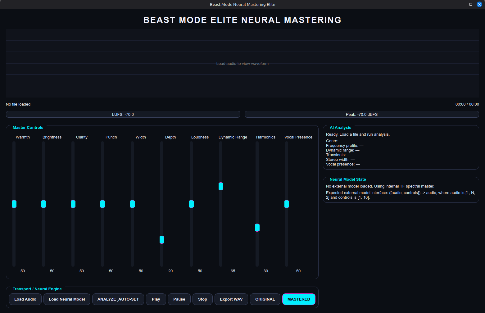

# Beast Mode Mastering

AI-powered Linux desktop audio mastering assistant for Linux, built with PyQt6, featuring TensorFlow-assisted track analysis, real-time mastering preview, stable DSP processing, waveform visualization, transport controls, original-versus-mastered A/B comparison, GUI WAV export, command-line WAV export, and optional Linux desktop launcher integration.

This repository is a frozen working snapshot of the current Linux desktop mastering assistant. The goal of this project is to provide a Linux-first audio mastering tool that people can run locally, inspect, improve, and extend. The project already works as a real application, but it is still a prototype in important areas, especially mastering quality, contributor polish, and long-term AI direction.

## Application screenshot

> Put the screenshot file in the repo at `docs/images/beast-mode-mastering-main-window.png` so the image below renders correctly on GitHub.



## What this application is

Beast Mode Mastering is a Linux desktop mastering assistant. It is meant to help a user load an audio file, analyze the track, preview playback, compare original versus mastered output, and export a mastered WAV. It is not pretending to already be a finished commercial mastering product. It is a real Linux desktop application and a real open-source project that contributors can work on.

The current project is best understood as a smart mastering assistant with AI-assisted analysis and a stable DSP-based mastering path. TensorFlow plumbing exists in the project, but this freeze is not yet a trained end-to-end commercial mastering model. DDSP is intentionally not a required runtime dependency in this snapshot because the current priority is keeping the baseline stable and easy to run on Linux.

## Current status

Current status of this freeze:

- the GUI loads audio
- the application analyzes tracks
- playback preview works
- original vs mastered A/B comparison works
- the current active rendering path is the stable DSP path
- GUI WAV export works
- command-line WAV export works
- optional desktop launcher / applications-menu integration is included
- the app still includes TensorFlow-related plumbing
- the app is not yet a trained checkpoint-driven commercial mastering engine
- DDSP is intentionally not a required runtime dependency in this freeze

## What is working

The following parts are currently working in the freeze:

- launching the GUI on Linux
- loading audio files
- analyzing tracks
- generating automatic control suggestions
- preview playback
- play / pause / stop controls
- original vs mastered switching
- waveform display
- transport controls
- stable DSP mastering path
- 24-bit WAV export from the GUI
- 24-bit WAV export from the command-line path
- Linux desktop launcher / applications-menu integration scripts
- Linux-focused developer workflow

## What is still rough

The following areas still need work:

- mastering quality is still prototype-level
- the current AI layer is analysis-assisted, not a fully trained end-to-end mastering model
- the playback, export, and application state handling still need cleanup
- the neural path is not production-ready
- the current DSP path favors stability over aggressive mastering
- the UI still needs polish
- more Linux distro testing is needed
- more screenshots and demo media are still needed
- contributor docs still need improvement
- logging and diagnostics need work

## What I want next

The next major goals for the project are:

1. improve mastering quality
2. improve auto-analysis quality
3. improve playback and export reliability
4. improve waveform and meter UX
5. improve Linux packaging and setup clarity
6. improve contributor friendliness
7. add better presets and profiles
8. improve diagnostics and logging
9. move toward a learned mastering controller
10. eventually support a stronger checkpoint-driven mastering workflow

## Repo layout

Main parts of the repository:

- `src/beast_mode_mastering/app.py` — main GUI application
- `scripts/export_mastered_cli.py` — reliable non-GUI exporter
- `scripts/install_desktop_integration.sh` — installs a desktop launcher, menu entry, and icon files for Linux
- `scripts/uninstall_desktop_integration.sh` — removes the desktop launcher, menu entry, and icon files
- `assets/icons/beast-mode-mastering.svg` — source icon artwork for launcher and menu integration
- `docs/BUILD_LINUX.md` — distro-specific build and run notes
- `freeze/FREEZE_NOTES_2026-03-30.md` — snapshot notes
- `freeze/SHA256SUMS.txt` — hash manifest for the freeze

## Linux build and run instructions for beginners

This project is a Python application. On Linux, the practical build path is:

1. install the system packages the app needs
2. download or clone the repository
3. move into the project folder
4. create a Python virtual environment
5. activate the virtual environment
6. install the Python requirements with `pip`
7. install the project itself into that environment
8. launch the app
9. optionally install the desktop launcher and applications-menu entry

If you are new to Linux development, do not overthink the word "build" here. For this project, "build" mostly means getting the right Linux packages installed and getting the Python environment set up correctly.

## Important note for Linux Mint / pyenv users

On some systems, especially when `pyenv` is installed, the bare `python` command may not work correctly before a virtual environment is active. On those systems, use `python3` to create the virtual environment.

That means this is the safest setup pattern:

```bash
python3 -m venv .venv
. .venv/bin/activate
python -m pip install --upgrade pip
python -m pip install -r requirements.txt
python -m pip install -e .
python -m beast_mode_mastering.app
```

The extra `python -m pip install -e .` step is required because this repository uses a `src/` layout. Installing only `requirements.txt` installs the dependencies, but not the local `beast_mode_mastering` package itself.

## First: find out what Linux distro you are using

If you are not sure what distro you are running, open a terminal and run:

```bash
cat /etc/os-release
```

Look for the distro name in the output. Then use the matching section below.

## Common things this project needs

No matter which Linux distro you use, this project expects the following:

- Python 3.10 or newer
- `pip`
- `venv` support
- Python development headers
- PortAudio runtime and development files
- `libsndfile`
- FFmpeg CLI tools
- a normal C/C++ toolchain in case a Python dependency has to build locally

## Get the repository source code

You need the project files before you can run anything.

You can either clone the repo with Git or download it as a zip from GitHub.

### Option 1: clone the repository

```bash
git clone https://github.com/Slighting4275/beast-mode-mastering.git
cd beast-mode-mastering
```

### Option 2: download the zip from GitHub

If you do not want to use `git` yet:

- open the GitHub repo page
- click the green **Code** button
- click **Download ZIP**
- extract the zip somewhere on your Linux system
- open a terminal in the extracted folder

Example:

```bash
cd "/path/to/the/extracted/beast-mode-mastering-folder"
```

If you want to contribute code later, cloning with `git` is better.

## Arch / Manjaro / EndeavourOS build instructions

This section is for Arch Linux, Manjaro, EndeavourOS, and similar Arch-based systems.

### Step 1: install the required system packages

Run this:

```bash
sudo pacman -S --needed git python python-pip ffmpeg portaudio libsndfile base-devel
```

What these packages do:

- `git` = lets you clone the repo
- `python` = Python itself
- `python-pip` = Python package installer
- `ffmpeg` = media/audio command-line support
- `portaudio` = low-level audio I/O library
- `libsndfile` = audio file reading/writing library
- `base-devel` = compiler and build tools for fallback wheel builds

### Step 2: clone or enter the project folder

If you are cloning:

```bash
git clone https://github.com/Slighting4275/beast-mode-mastering.git
cd beast-mode-mastering
```

If you downloaded the zip, extract it and then `cd` into the extracted folder.

### Step 3: create the virtual environment

Run:

```bash
python -m venv .venv
```

### Step 4: activate the virtual environment

Run:

```bash
. .venv/bin/activate
```

### Step 5: upgrade pip

Run:

```bash
python -m pip install --upgrade pip
```

### Step 6: install Python dependencies

Run:

```bash
python -m pip install -r requirements.txt
```

### Step 7: install the local project package

Run:

```bash
python -m pip install -e .
```

### Step 8: launch the app

Run:

```bash
python -m beast_mode_mastering.app
```

If the window opens, the setup worked.

## Ubuntu / Debian / Linux Mint build instructions

This section is for Ubuntu, Debian, Linux Mint, Pop!_OS, and similar Debian-based systems.

### Step 1: update package lists

Run:

```bash
sudo apt update
```

### Step 2: install the required system packages

Run:

```bash
sudo apt install -y git python3 python3-venv python3-pip python3-dev portaudio19-dev libsndfile1 ffmpeg build-essential
```

What these packages do:

- `git` = clone the repo
- `python3` = Python itself
- `python3-venv` = virtual environment support
- `python3-pip` = Python package installer
- `python3-dev` = Python development headers
- `portaudio19-dev` = PortAudio development package
- `libsndfile1` = sound file library
- `ffmpeg` = media/audio command-line tools
- `build-essential` = compiler and build tools

### Step 3: clone or enter the project folder

If cloning:

```bash
git clone https://github.com/Slighting4275/beast-mode-mastering.git
cd beast-mode-mastering
```

If you downloaded the repo as a zip, extract it and change into that directory.

### Step 4: create the virtual environment

Run:

```bash
python3 -m venv .venv
```

### Step 5: activate the virtual environment

Run:

```bash
. .venv/bin/activate
```

### Step 6: upgrade pip

Run:

```bash
python -m pip install --upgrade pip
```

### Step 7: install Python dependencies

Run:

```bash
python -m pip install -r requirements.txt
```

### Step 8: install the local project package

Run:

```bash
python -m pip install -e .
```

### Step 9: launch the app

Run:

```bash
python -m beast_mode_mastering.app
```

If the GUI opens, the setup worked.

## Optional desktop launcher / applications menu setup on Linux Mint / Ubuntu / Debian

If you want the desktop launcher, applications-menu entry, and icon install script, install the extra packages for that path:

```bash
sudo apt update
sudo apt install -y librsvg2-bin desktop-file-utils
```

Then from the project root, run:

```bash
bash ./scripts/install_desktop_integration.sh
```

That installs:

- `~/.local/bin/beast-mode-mastering`
- `~/.local/share/applications/beast-mode-mastering.desktop`
- icon files under `~/.local/share/icons/hicolor/`

After that, the app should appear in the applications menu as **Beast Mode Mastering**.

If you want to remove that desktop integration later, run:

```bash
bash ./scripts/uninstall_desktop_integration.sh
```

## Fedora build instructions

This section is for Fedora.

### Step 1: install the required system packages

Run:

```bash
sudo dnf install -y git python3 python3-pip python3-devel portaudio-devel libsndfile ffmpeg-free gcc gcc-c++ make redhat-rpm-config
```

What these packages do:

- `git` = clone the repo
- `python3` = Python itself
- `python3-pip` = Python package installer
- `python3-devel` = Python headers
- `portaudio-devel` = PortAudio development package
- `libsndfile` = sound file library
- `ffmpeg-free` = FFmpeg package from Fedora’s normal package path
- `gcc`, `gcc-c++`, `make`, `redhat-rpm-config` = build toolchain

### Step 2: clone or enter the project folder

If cloning:

```bash
git clone https://github.com/Slighting4275/beast-mode-mastering.git
cd beast-mode-mastering
```

If you downloaded the zip, extract it and move into the extracted directory.

### Step 3: create the virtual environment

Run:

```bash
python3 -m venv .venv
```

### Step 4: activate the virtual environment

Run:

```bash
. .venv/bin/activate
```

### Step 5: upgrade pip

Run:

```bash
python -m pip install --upgrade pip
```

### Step 6: install Python dependencies

Run:

```bash
python -m pip install -r requirements.txt
```

### Step 7: install the local project package

Run:

```bash
python -m pip install -e .
```

### Step 8: launch the app

Run:

```bash
python -m beast_mode_mastering.app
```

## RHEL / Rocky / Alma / CentOS Stream build instructions

This section is for Enterprise Linux style systems such as RHEL, Rocky Linux, AlmaLinux, and CentOS Stream.

These systems often need a little more repository setup than Arch, Debian, Ubuntu, Mint, or Fedora.

### Step 1: install the core packages first

Run:

```bash
sudo dnf install -y git python3 python3-pip python3-devel portaudio-devel libsndfile gcc gcc-c++ make redhat-rpm-config
```

### Step 2: make sure FFmpeg is available

FFmpeg may come from a different repository path on Enterprise Linux style systems.

Standardize your FFmpeg source first, then continue.

### Step 3: clone or enter the project folder

If cloning:

```bash
git clone https://github.com/Slighting4275/beast-mode-mastering.git
cd beast-mode-mastering
```

If you downloaded a zip, extract it and enter the extracted folder.

### Step 4: create the virtual environment

Run:

```bash
python3 -m venv .venv
```

### Step 5: activate the virtual environment

Run:

```bash
. .venv/bin/activate
```

### Step 6: upgrade pip

Run:

```bash
python -m pip install --upgrade pip
```

### Step 7: install Python dependencies

Run:

```bash
python -m pip install -r requirements.txt
```

### Step 8: install the local project package

Run:

```bash
python -m pip install -e .
```

### Step 9: launch the app

Run:

```bash
python -m beast_mode_mastering.app
```

## Quick start for impatient people

If you already know what you are doing and just want the short version, this is the correct quick start after you are inside the repo:

```bash
python3 -m venv .venv
. .venv/bin/activate
python -m pip install --upgrade pip
python -m pip install -r requirements.txt
python -m pip install -e .
python -m beast_mode_mastering.app
```

## Recommended first-run check

Before launching the GUI, it is a good idea to confirm that Python can import the project successfully.

From the project root:

```bash
. .venv/bin/activate
python -m pip install -e .
python -c "import beast_mode_mastering.app; print('import OK')"
```

If that prints `import OK`, try launching the GUI:

```bash
. .venv/bin/activate
python -m beast_mode_mastering.app
```

## GUI export

The GUI now includes an **Export WAV** button.

Normal GUI export flow:

1. launch the app
2. load an audio file
3. click **Export WAV**
4. choose the output path and filename in the save dialog
5. save the mastered 24-bit WAV

## CLI export

The project also includes a command-line export path.

Example:

```bash
. .venv/bin/activate
python scripts/export_mastered_cli.py "/path/to/input.wav" "/path/to/output_mastered.wav"
```

Example using your home folder:

```bash
. .venv/bin/activate
python scripts/export_mastered_cli.py "$HOME/Music/input.wav" "$HOME/Music/output_mastered.wav"
```

## Screenshots

The repository now includes a main-window screenshot.

If you add the file to the repo at `docs/images/beast-mode-mastering-main-window.png`, the screenshot near the top of this README will render on GitHub.

More useful screenshots to add later:

- waveform and transport controls with an actual loaded track
- analysis results after auto-set
- original vs mastered A/B view
- export flow and save dialog
- desktop launcher and applications-menu entry

## What I want help with

Good contribution areas right now include:

- improving mastering quality
- improving analysis-to-control mapping
- improving playback and export state handling
- improving waveform and meter UX
- reducing harshness or overprocessing
- improving Linux packaging and setup
- improving logging and diagnostics
- adding screenshots and demo assets
- moving the project toward a learned mastering controller

## Suggested issues to create

Good GitHub issues to open for contributors:

- improve README with more screenshots and contributor guidance
- fix GUI export edge cases
- refactor playback and file reload state handling
- improve DSP mastering quality
- reduce harshness in the current mastering path
- improve waveform and transport UX
- add better logging for playback and export failures
- test on Arch, Ubuntu/Debian, and Fedora
- design learned controller to replace heuristic auto-set
- add more screenshots and demo section to the repo
- improve desktop integration documentation across distros

## Troubleshooting

### `pip install -r requirements.txt` fails

Check all of the following:

- you are inside the project folder
- the virtual environment is activated
- the distro-specific system packages were installed first
- the Python development headers are installed
- the basic build tools are installed

Common missing pieces:

- Debian / Ubuntu / Mint: `python3-dev` or `build-essential`
- Arch-based distros: `base-devel`
- Fedora / EL-family systems: `python3-devel`, `gcc`, `gcc-c++`, `make`, or `redhat-rpm-config`

### The app will not launch

Check:

- that `.venv` is activated
- that the requirements installed correctly
- that the project itself was installed with `python -m pip install -e .`
- that you are in the project root
- that Python can import the app module

Try:

```bash
. .venv/bin/activate
python -m pip install -e .
python -c "import beast_mode_mastering.app; print('import OK')"
```

### Audio playback problems

If the GUI opens but playback does not work, confirm that:

- PortAudio was installed correctly
- your Linux audio stack works normally outside this app
- your user account has a valid default output device

### Desktop launcher or icon issues

If the app runs but the applications-menu entry or icon does not show correctly, confirm that:

- you ran `bash ./scripts/install_desktop_integration.sh` from the project root
- on Debian / Ubuntu / Linux Mint, `librsvg2-bin` and `desktop-file-utils` are installed
- the desktop file exists at `~/.local/share/applications/beast-mode-mastering.desktop`
- the icon files exist under `~/.local/share/icons/hicolor/`

If needed, rerun:

```bash
bash ./scripts/install_desktop_integration.sh
```

### Import path problems

Run commands from the repository root and make sure the local package was installed into the active virtual environment.

Correct:

```bash
python -m pip install -e .
python -m beast_mode_mastering.app
```

Wrong:

running the app command from some unrelated directory or skipping installation of the local package when using the `src/` layout

## Contributing

Small and focused pull requests are preferred. If you want to make a bigger change, opening an issue first is the best path so the direction is clear before a large amount of work happens.

## Packaging notes

This is a Python application. On Linux, the practical "compile" step is installing the required system libraries, creating a Python environment, installing dependencies, and then installing the local project package into that environment.

The repo also includes optional Linux desktop integration scripts for users who want the app to appear in the applications menu with an installed launcher and icon.

## License

This project is licensed under the GNU General Public License v3.0 or later (GPL-3.0-or-later).

If you distribute modified versions of this project, you must also make the corresponding source code available under the GPL.
